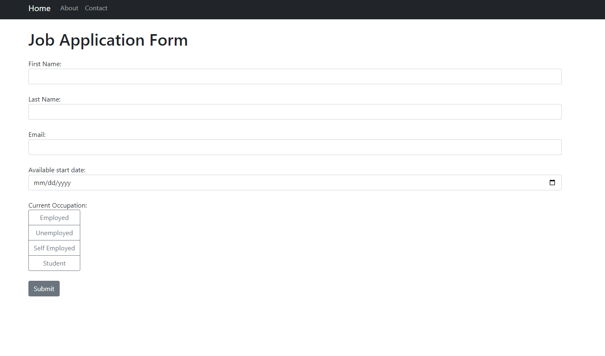

# About this repository
This repository gnerates a web app which is a simple form for job application. The form asks the user's name, email and date of employment.

## Features
- The user can navigate to `About` and `Contact` pages
- The app sends a confirmation mail with a copy of the supplied details on the mail specified in the form
- The user can access the admin interface by creating a superuser and accessing the website using http://127.0.0.1:8001/admin/

# How to run
After cloning it to a local directory, the web app can be launched using :
<pre>
python manage.py runserver
</pre>

## Dependencies
<pre>
asgiref==3.7.2
Django==4.2.5
sqlparse==0.4.4
tzdata==2023.3
</pre>
The `requirements.txt` file is also included